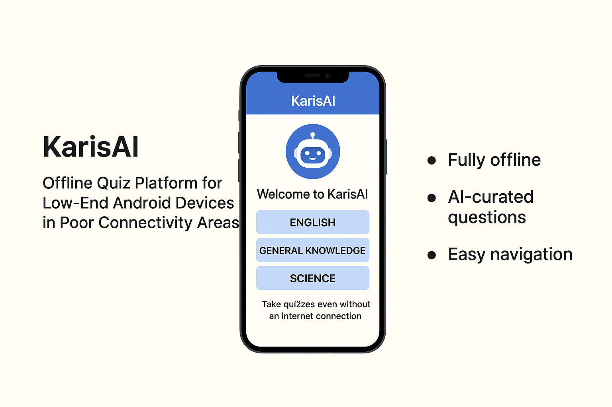

#KarisAI
**Offline Quiz Platform for Low-End Android Devices in Poor Connectivity Areas**

---

## 📌 Inspiration

In Kaduna North, many learners are left behind due to poor internet access and limited access to educational tools. I’ve met many talented youths who want to study but can’t afford data-heavy platforms or high-end smartphones. That’s what inspired KarisAI — a lightweight offline quiz platform made for resource-limited environments.

---

## 🚀 Project Overview

KarisAI is a mobile quiz application designed to run on low-end Android devices with no internet required. Students can revise and test their knowledge anytime, anywhere.

### Key Features:
- 📴 **Fully offline**: No internet needed to access quizzes
- 🤖 **AI-curated questions**: Generated to match topics in school curriculum
- 💡 **Easy navigation**: User-friendly interface for all levels of learners
- 🧠 **Progress tracking**: Simple feedback to show learning performance

---

## 📱 Demo

Here’s a preview of the app:

---

## 📦 APK Download

> 🔗 [Click here to download the latest APK](#)  
*Note: Replace the link above once APK is uploaded.*

---

## 🔧 How to Use

1. Download and install the APK on your Android phone.
2. Open the app (no login required).
3. Select a subject and start a quiz.
4. See your score instantly after completing each session.

---

## 🎯 Target Users

- Students in remote/rural areas
- Candidates preparing for WAEC, NECO, or UTME
- Organizations seeking offline training tools

---

## 🤝 Contributing

Ideas and contributions are welcome! If you’re passionate about education or working on similar problems, feel free to fork the repo and suggest improvements.

---

## 📫 Contact

Want to collaborate or ask a question?  
Reach me via Instagram: [@Abdulbaaasid](https://instagram.com/Abdulbaaasid)  
Or message me on GitHub directly.
Email: AbdulbasidAbdallah@gmail.com

---

> KarisAI – Empowering learners, even where the network can’t reach.njj
